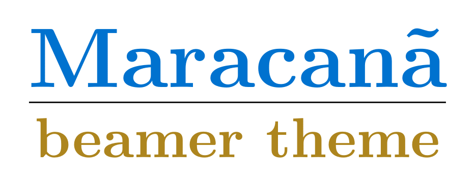

**Maracanã beamer theme** is an beamer theme for presentations, inspired in the Rio de Janeiro State University (UERJ) color code. 

## Author

Michel Tosin
 
## Software History

This beamer theme was created to be used in the prof. Americo Cunha Jr.'s research group meetings.

## Citing Maracana

```
@misc{Maracana:2021,
      author       = { M. Tosin },
      title        = { Maracan\~{a} beamer theme },
      year         = { 2021 },
      publisher    = { GitHub },
      journal      = { GitHub repository },
      howpublished = { \url{https://github.com/TosinMA/Maracana} } 
}
```

## License

**Maracana** is released under the MIT license. See the LICENSE file for details. All new contributions must be made under the MIT license.
